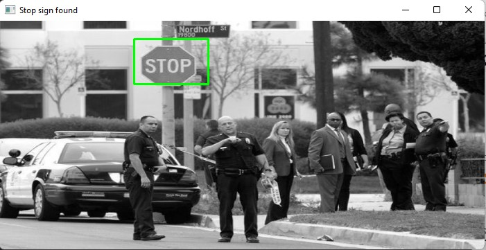
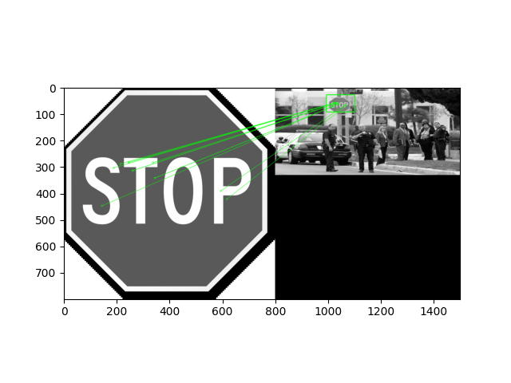
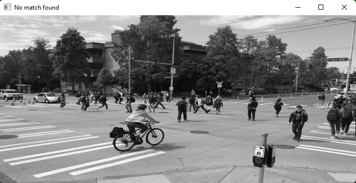

# SIFT Based Project
 This is a stop sign detection program using SIFT. The primary purpose is to detect stop signs in black and white bitmap images. 
 
There is only one python script, which can be run with "python sift_feature_matching.py" or using Visual Studio Code's automatic code runner.

Stop sign template and corresponding SIFT features:
 

Example output when stop sign is detected:
  

Example output when stop sign is not detected:
  

